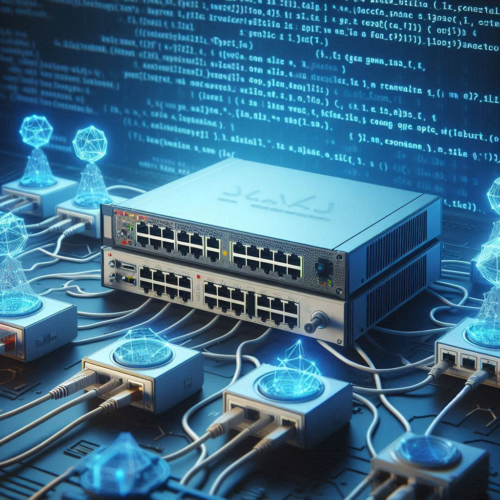

# Introduction to networking for programmers

## Goal

To provide a meaningful introduction to computer networking for people with a programmer education or background. Ideally, everyone who attends this course will leave understanding the fundamentals of networking and be "baselined" and therefore able to clearly communicate with the network engineers in their organizations.

## Some details

We'll, via zoom or a similar platform create 4-8 recorded sessions of educational material that will allow IT staff not formally educated in networking to be able to move to a more advanced level of study or at least be able to communicate using the proper terminology with their networking peers at work.

The course is loosely related to the Cisco Certified Network Associate course and assumes that all modern enterprise networks are either Cisco or based on vendors who closely mirror Cisco's methods (they all do).

Most of the course will be theoretical, but all technologies will be presented and demoed on simulated Cisco equipment with details provided by inspecting traffic and packets moving through the network via WireShark.

Topics often heavily focused on within classical network training will be greatly abbreviated by describing them in terms of math (simple math), algorithms, or programming.

## Schedule

As soon as I can get everyone I've promised over the past few months that I'd teach this course into one place (here and the [Facebook Page](https://www.facebook.com/groups/1235189824352111)), I'll send an invite to a Zoom where we can discuss and agree upon a schedule, platform, etc...

I expect there to be 4 sessions of 3-5 hours each. If we have a lot of questions and feedback (or if everything goes horribly wrong during the demos), it might be up to two more sessions.

For people interested in attending physically, we'll have to use my maker space at Caspar Storms Vei 12A as the university isn't allowed to host "external courses". (Gard checked for me). I have room for 6-10 people comfortably and we are well stocked for drinks and snacks.

We of course will be remote as well via Zoom.

## Outline

- What is a network?
- What is a topology?
- Physical vs Logical topologies
- The OSI Model
- Encapsulation/De-encapsulation
- How does Ethernet communicate?
- What is a network card and how does it work?
- What is a broadcast domain (I.E. what is a LAN)?
- What is a hub?
- Half Duplex, Full Duplex and MDI-X
- What is a bridge? (Forward, Filter, Flood, Learn)
- What is a switch?
- What is a loop/broadcast storm?
- What is a VLAN?
- How to prevent loops with spanning tree
- (time permitting, how the protocol works)
- What kinds of spanning tree are there?
- What is IP?
- Where do IP addresses come from?
- RFC1918 addresses
- Classful vs Classless networks/subnets.
- What is IPv6?
- What is routing?
- How are forwarding decisions made by end-points?
- How are forwarding decisions made by routers?
- What is a routing protocol and how does it work?
- The control plane and the data plane
- IGPs vs EGPs
- Introduction to OSPF
- Introduction to BGP
- Choosing which route to use?
- Access control lists
- Static NAT
- Dynamic NAT
- Static PAT
- Dynamic PAT
- Wireless access points and controllers
- What is the difference between enterprise and data center networking?
- Software defined networking
- Network programability

## A little about the teacher

I think most everyone will know me, but for the random adds (there will be a few), I'm Darren Starr. I've taught 1-week long networking courses in over 30 countries over 10 years to over 1000 students. I've been implementing protocols in code since I was 14 years old when I made my first network following soldering together a null modem cable made with parts from Radio Shack (my childhood paradise) and implementing device drivers for DOS in assembly. I've worked on networks as small as one box on a shelf to massive multi-data center wide area networks. I've taught the Cisco CCNA 5-10 day official training at least 100 times over a period of 12 years. Now I spend my time doing things like designing and sewing my best friend's wedding dress which I consider quite a bit scarier and more challenging.
